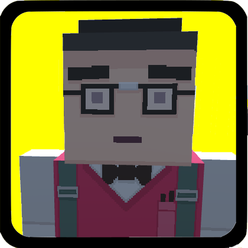

## Presentation
Sewer Survivor is a video game made with Unity as a project for the Artificial Intelligence class, by Jose Rodriguez and David Valdivia, two students of the UPC university (CITM), located in Terrassa (Barcelona).

## The game
Sewer Survivor takes place in a desertic area where a company of people called "The Sewer Crew" have to survive while finding a cure for a disease that has caused the apocallypsis. They will have to find the cure in less than 7 days or they will be done for! Will you be able to find the cure in Sewer Survivor?

### Types of agents:
Citizen

You'll need to mantain these guys alive in the game at all costs. They can be killed by zombies and the disease.

Medic

They are the ones that will investigate the cure during the day. They also cure the humans temporarily of the disease.

Militar

The militars will defend your base from zombies and will recollect food for the humans of the camp to consume and to create more militars and humans.

Zombie

Zombies will try to enter your citadel and kill everyone inside, so be careful. Only some fences are preventing them from entering. They will break them, but you can fix them to contain them some time outside the camp in order for the militars to kill them.

## The team
_Jose Rodriguez_
* **Github**: [joserm45](https://github.com/joserm45)

### Work Done:

_David Valdivia_
* **Github**: [ValdiviaDev](https://github.com/ValdiviaDev)

### Work Done:
* Some of the steering behaviours
* Wander atomic behaviour
* Human and Medic behaviours and behaviour trees
* Start & Finish screens and its transitions
* UI and sound design/implementation
* Area upgrade system
* End of the day food fee system

## Installation

Unzip the release folder and execute the .exe file to play.

[Game Release](https://github.com/ValdiviaDev/Sewer-Survivor/releases/tag/1.0)

### Recomended resolution:

* Minimum: 1024 x 786

* Recomended: 1280 x 720 or greater

## Gameplay Video
<iframe width="560" height="315" src="https://www.youtube.com/embed/qTka5CoWA6w" frameborder="0" allowfullscreen></iframe>

## Game Controls

   * Left click ➲ Interact with the various buttons and construction modules.

To move the camera:

   * W ➲ To move forward
   
   * A ➲ To move left
   
   * D ➲ To move right
   
   * S ➲ To move back

   * Mouse ➲ Move the mouse to the borders of the screen to move the camera in that direction.

## Tools used

* Made with Unity Engine 2018 1.6f
* Recast library (Integrated with Unity)
* BG Curve v.1.1 package for Unity
* NodeCanvas

## Resources used

Art & animation:

* Simple assets package from the unity asset store

Music:
* Start Screen: Menu - Super Smash Bros. (Nintendo 64)
* In game day cycle: Sandship - The Legend of Zelda Skyward Sword (Wii)
* In game night cycle: Hyrule Field Night Time sounds - The Legend of Zelda: Ocarina of Time (N64)
* Finish Screen: Observation Post - The Legend of Zelda Breath of the Wild (Wii U, Switch)

Sound Effects:
* Minecraft death sound
* Minecraft zombie death sound
* Various sounds from Warcraft for the UI, construction and healing
* Sounds of a rooster and a wolf from The Legend of Zelda: Ocarina of Time

## License

MIT License

Copyright (c) 2018,  Jose Antonio Rodriguez Millan, David Valdivia Martínez

Permission is hereby granted, free of charge, to any person obtaining a copy
of this software and associated documentation files (the "Software"), to deal
in the Software without restriction, including without limitation the rights
to use, copy, modify, merge, publish, distribute, sublicense, and/or sell
copies of the Software, and to permit persons to whom the Software is
furnished to do so, subject to the following conditions:

The above copyright notice and this permission notice shall be included in all
copies or substantial portions of the Software.

THE SOFTWARE IS PROVIDED "AS IS", WITHOUT WARRANTY OF ANY KIND, EXPRESS OR
IMPLIED, INCLUDING BUT NOT LIMITED TO THE WARRANTIES OF MERCHANTABILITY,
FITNESS FOR A PARTICULAR PURPOSE AND NONINFRINGEMENT. IN NO EVENT SHALL THE
AUTHORS OR COPYRIGHT HOLDERS BE LIABLE FOR ANY CLAIM, DAMAGES OR OTHER
LIABILITY, WHETHER IN AN ACTION OF CONTRACT, TORT OR OTHERWISE, ARISING FROM,
OUT OF OR IN CONNECTION WITH THE SOFTWARE OR THE USE OR OTHER DEALINGS IN THE
SOFTWARE.

